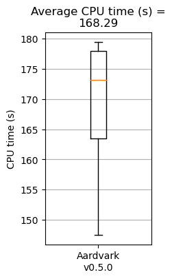
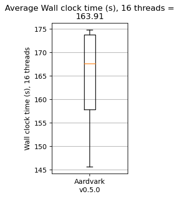
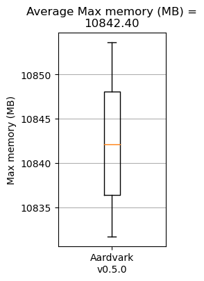

# Performance
## Comparison to other approaches
This section is a placeholder for comparison metrics for Aardvark.

## Compute resources
The following figures show the distributions of CPU time, wall-clock time (16 threads), and peak memory consumption for `aardvark compare` on a collection of query datasets against GIAB v4.2.1.

